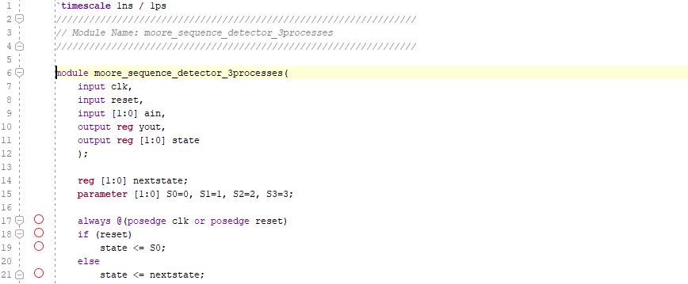

# Lab 10_ Finite State Machine

This lab introduces the concept of two types of FSMs, Mealy and Moore and the modeling styled to develop such machines

The major to take away this lab is able to model Mealy FSMs and Moore FSMs

## 10-part 1: Mealy FSM

## 	10-1-1 mealy_sequence_detector_3processes

#### Verilog code

#### RTL Schematic Screen Shot

#### Implementation Device screen shot zoomed in on something interesting

#### Testing

timing diagram

#### Prompt

The mealy state has one input (ain) and one output (yout). The output(yout) is 1 when the total number of 1s received is divisible by 3.

A mealy generate  the output and next state, and a state register which holds the present state. Mealy machine, the output depends on both the present (current) state and the present (current) inputs.

The state register is modeled as D flip-flops

## 10-1-2 moore_sequence_detector_3processes

#### Verilog code

#### RTL Schematic Screen Shot

#### Implementation Device screen shot zoomed in on something interesting

#### Testing

timing diagram

#### Prompt

The output of moore sequential is generated from the state register (D-flipflops) block.

The next state is determined using the current input and current state.

## 10-part 2: Mealy FSM Using ROM

## 10-3-1 mealy_ROM

#### Verilog code

* module count_ROM is inside the top level module mealy_ROM

#### RTL Schematic Screen Shot

#### Implementation Device screen shot zoomed in on something interesting

#### Testing

timing diagram

#### Prompt

The counting sequence will be: 000, 001, 011, 101, 111, 010 (repeat) 000, …