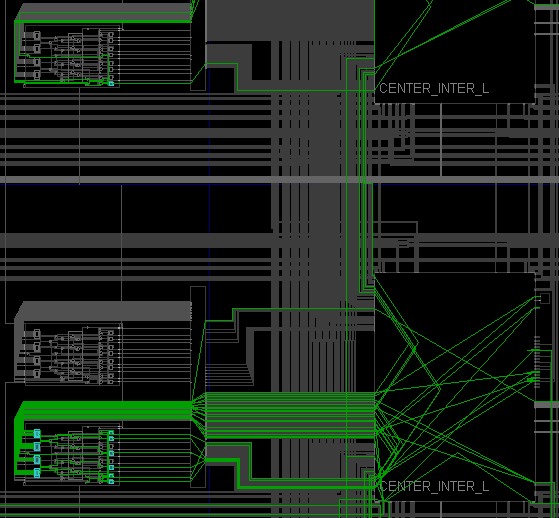
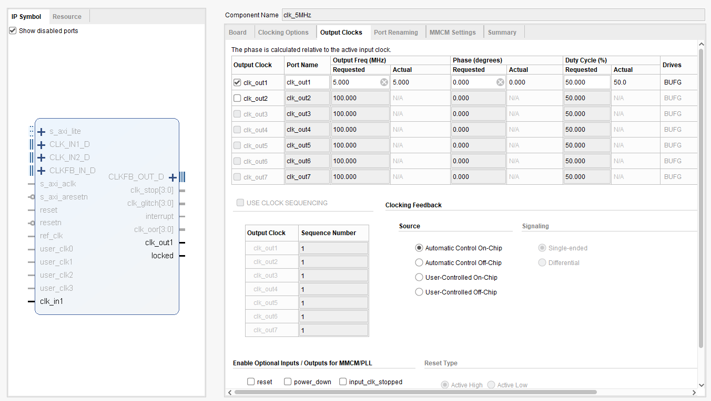
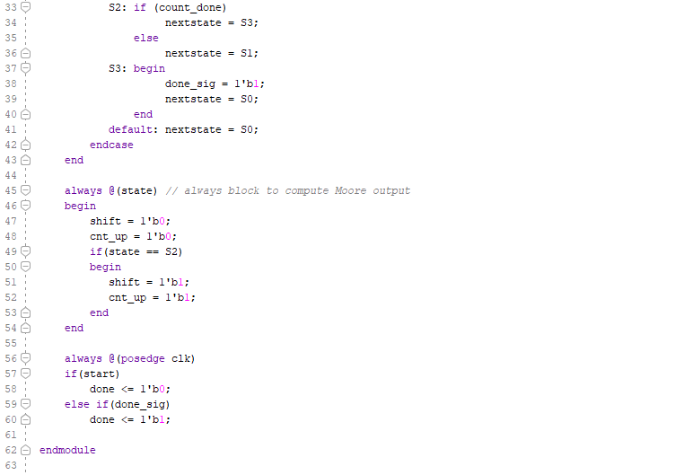

# Lab 11_ Sequential System Design Using ASM Charts

This lab introduces the Algorithmic State Machine (ASM) chart technique

The major to take away this lab is able to use the ASM charts to design sequential systems

## 11-part 1: ASM Charts

#### Verilog code

#### RTL Schematic Screen Shot

#### Implementation Device screen shot zoomed in on something interesting

#### Testing

timing diagram

## 	11-1-1 Multiplier 3x3

#### Verilog code 

#### RTL Schematic Screen Shot

#### Implementation Device screen shot zoomed in on something interesting

#### Testing

timing diagram

#### Prompt

an ASM chart for the control unit

## 11-1-2 

#### Verilog code

#### RTL Schematic Screen Shot

#### Implementation Device screen shot zoomed in on something interesting

#### Testing

the same testing with previous one

## 11-part 2: Sequential System Design Using ASM Chart

## 11-3-1 

#### Verilog code

* Top level: mult_4x4

* Bottom level: 

  * clk_5MHz

    

  * mult_4x4_cu

    

    

    

  * mult_4x4_operands_ROM

    

    

  * binary8Bit_to_3digitBCD (include the add3 module inside)

    

    

  * clk_divider_about_500hz_refresh_rate_4display

    

  * bcdto7segment_dataflow

    

  * pb_debouncer

    

    

#### RTL Schematic Screen Shot

#### Implementation Device screen shot zoomed in on something interesting

#### Testing

successful to program to the device with the ROM. 

just input the multiplicand and multiplier than press start. the output come out then