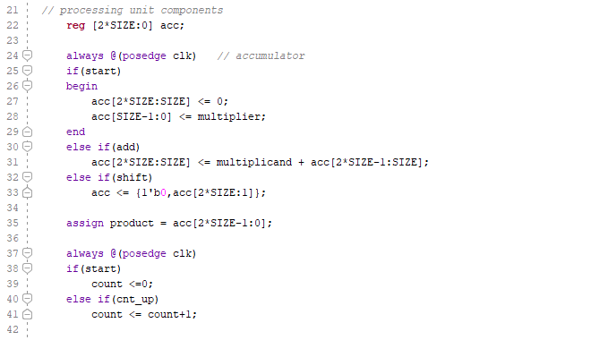

# Lab 11_ Sequential System Design Using ASM Charts

This lab introduces the Algorithmic State Machine (ASM) chart technique

The major to take away this lab is able to use the ASM charts to design sequential systems

## 11-part 1: ASM Charts

#### Verilog code

#### RTL Schematic Screen Shot

#### Implementation Device screen shot zoomed in on something interesting

#### Testing

timing diagram

## 	11-1-1 Multiplier 3x3

#### Verilog code 

#### RTL Schematic Screen Shot

#### Implementation Device screen shot zoomed in on something interesting

#### Testing

#### Prompt

## 11-1-2 

#### Verilog code

#### RTL Schematic Screen Shot

#### Implementation Device screen shot zoomed in on something interesting

#### Testing

#### Prompt

## 11-part 2: Sequential System Design Using ASM Chart

## 11-3-1 

#### Verilog code

#### RTL Schematic Screen Shot

#### Implementation Device screen shot zoomed in on something interesting

#### Testing

#### Prompt

