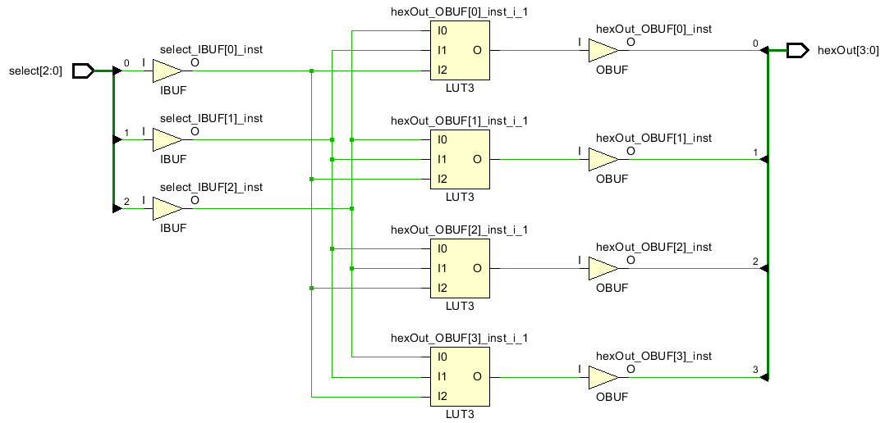

# Reusable BCD hex 7seg Display Code

The  HexToBCD algorithm in the last lab worked for one hex group. The problem is that it needs to be extended from 4 bits to 32 bits. Decoders, clocks and counters need to be added. The goal is to get that done here.

Figure out what a decoder does. Explain in the testing.

## 0Decoder

#### Port Diagram

#### Verilog Code

#### RTL Schematic Screen shot

#### Synthesis Schematic Screen shot

#### Implementation Device screen shot zoomed in on something interesting

Nothing new .. just a LUT

#### Testing

The 2Decoder has been turning 3 inputs to 16 outputs. When 1 input enter, 2 LED output light up. because it has 2 circuit at one time.

___

#### Prompts 

*What does ~| mean in front of the X?* **X is three bits. Or all the three bits together. (bitwise NOR)**

*How many decoder circuits does this code build?*  **2 .. one with gates, and one with a shift to the left  a certain number of bits. **

*Which verilog command(s) construct the RTL decoder?*  **assign z = 1 << x;** 

*What RTL construct do we think of instead of a decoder?*  **shift register**

## 1_32bitCounting

This code tests the ability to count clock pulses and display 32 bits split into two groups of 16. SW[0] switches between the two groups. 

#### Port Diagram

#### Verilog Code

#### 

#### RTL Schematic Screen shot

#### Synthesis Schematic Screen shot

#### Implementation Device screen shot zoomed in on something interesting

First Flip Flops Being Used, 

Carry Logic Being used

#### Testing

SW[0] the LED fill up slowly. SW[1] the LED fill up instantly. (The power is not enough so that why the LED from the left lighter than the LED from the right side). reset to start over

___

#### Prompts

The Nexys4DDR goes at 100,000,000 cycles per second. FFFF FFFF bits HEX  is  4,294,967,295. 
*Approximately how many seconds would there be between starting to count over again at 0?* **4,290,000,000/100,000,000 = 42.9 seconds**
*Approximately how many seconds would it take the last bit to change?* **FFF FFFF is 268,435,455 decimal so 
268,000,000/100,000,000 = 2.68 seconds**
*Approximately how many seconds would it be visible?* 
**42.9-2.68=40.2 seconds**

## 2_bitSlicing

The goal  is to find a way to grab 4 bits out a group of 32 in a single line of code.  This technique is called bit slicing.  This is similar to slicing up a string or an array in other languages. 

#### Port Diagram

#### Verilog Code 

#### RTL Schematic Screen shot

#### Synthesis Schematic Screen shot

#### Implementation Device screen shot zoomed in on something interesting

Four Luts are used to handle the multiplying asked for in the bit slicing.

#### Testing

3 Select bits select 1 of 8, 4 bit groups from a 32 bit constant and display on LEDs.  The constant is inside the port diagram:

------

#### Prompts

Slicing or Slitting is part of a number of languages including  [python](https://www.programiz.com/python-programming/methods/built-in/slice) , [matlab](https://stackoverflow.com/questions/11318724/matlabs-slice-function-not-working-as-desired), [perl](https://perldoc.perl.org/functions/split.html) and is a common concept name to use when searching for something similar in other languages [C](https://stackoverflow.com/questions/14618342/copying-a-subset-of-an-array-into-another-array-array-slicing-in-c), [regular expressions](https://stackoverflow.com/questions/35578470/how-to-slice-characters-from-string-using-regex). *Is slice or split a concept or syntax in verilog*? Concept.

In the SystemVerilog standard [IEEE_Std1800-2017](https://github.com/ENES-246DigitalElectronics/ENES247/blob/master/IEEE_Std1800-2017_8299595.pdf) (released in Feb. 2018), search for "+:" . *What section, sub-section, sub-sub section ... etc. is this documented .. and how is this described?* 

7. Aggregate data types
   7.4 Packed and unpacked arrays
   7.4.3 Operations on arrays
   	— Reading and writing a variable slice of the array, e.g., A[x+:c] = B[y+:c]

Suppose this test didn't work. You would then go to the Xilinx's reference called [ug901-vivado-synthesis.pdf](https://github.com/ENES-246DigitalElectronics/ENES247/blob/master/ug901-vivado-synthesis.pdf) which is randomly updated.  *What page is "+:" found  that is not in the middle of code and how is it described?* 

On page 222 in Dec. 19, 2018 version of ug901 is described as  "Variable Part Selects Verilog Coding Example".

*Given that the "+:" symbol appears in Xilinx documents as well as the standard, what percentage confidence do you have that this will synthesize in Vivado?* 

90% confident .. it has worked in the past. No reason for it to stop working now.

Look at this chart describing the growth of Verilog/SystemVerilog. The 2017 standard, reportedly did not add any new functionality to the 2012 standard. *The "+:" concept is actually listed on this chart. What is it's name?*  [Variable part select](https://www.google.com/search?q=verilog+variable+part+select&rlz=1C1CHZL_enUS735US735&oq=verilog+variable+part+select)

*Given that it is part of the older Verilog standard before it merged with SystemVerilog, how confident are you now that it should work?* 100%

The 2017 standard, reportedly did not add any new functionality to the 2012 standard. *How relevant do you think [this document](http://sutherland-hdl.com/papers/2013-SNUG-SV_Synthesizable-SystemVerilog_paper.pdf) (that the graphic from above came from) is?* Very relevant

*The word "design" above means the code will work where in the Vivado workflow? (Simulate, RTL, Synthesize, Implement, Bitstream)* Synthesize. 

*The word "verification" above means the code will work where in the Vivado workflow?* Simulate. 

*How does the IEEE_Std1800-2017 describe these two parts of SystemVerilog?* The same way.

## 3_32bitHexToBCDto16LEDs

## Design Flow: 

Starting point is this [algorithm](https://pubweb.eng.utah.edu/~nmcdonal/Tutorials/BCDTutorial/BCDConversion.html). 

### Outlining the starting point algorithm:

​	Create 4 bit registers for the BCD output called 100s, 10s, 1s for a total of 12 bits
​	Hook up 8 switches to 8 input bits named binary (HEX)
​	Hook up the BCD groups of four bits to LEDs

​	Set all BCD bits to 0.

​	step through the Hex bits 
​		if BCD output (in any 4 bit group) is greater than 5, add 3
​		shift BCD Left with MSB to the right shifted into the next BCD 4 bit group to the left
​		shift the binary digit into the 1s least significant. 

​	Test with 12 LED's.

### Outlining an Extended Algorithm:

This code is going to get long and ugly. More mistakes. Harder to read, less sustainable (other engineers can grow it to handle more bits, other engineers can fix it if the verilog code is no longer supported)

 Here is outline of the code

So make BCD one 32 bit integer, initially 0.

For each bit in HEX
	For each 7seg display (8 in our case)
		Split the BCD into an associated 4 bit group
		Add 3 to the group if larger or equal to 5
	Shift entire BDC left, putting Hex bit in the LSB of BCD

So the big difference in this extended algorithm is taking the repeating pattern in the starting code and nesting it in a for loop within a for loop. 

The trick is going to be splitting the BCD group into an associated 4 bit group. But we already practiced how to do that!

### Testing the Extended Algorithm:

Hex is a more compacted way of storing a number. BCD takes Hex and spreads it out over more digits.  These screenshots of a Windows computer calculator in programming mode illustrate this. This first one maxes out 32  bits hex. This is 4Gig of bits. It would require 10 sevenSegDisplays. 

This next one would require 9 sevenSegDisplays. The Hex value looks random or arbitrary.

This requires 8 sevenSegDisplays. So our maximum Hex input is 28 bits. The result will be BCD 32 bits. 

We could make the 2 Hex values or 8 bits changeable. Perhaps 9F at the end. This way there would be 10 values that would change the BCD output and 6 values that would cause an overflow. Can we add code to detect an overflow? Would have to capture MSB value of a 1 before a left shift and attach it to an LED. 

Test the starting point code, and then write the extended code and document it here. 

#### Port Diagram

#### Verilog Code

#### RTL Schematic Screen shot

#### Synthesis Schematic Screen shot

#### Implementation Device screen shot zoomed in on something interesting

#### Testing

----

Prompts

## 4Clocks

#### Port Diagram

#### Verilog Code 

#### RTL Schematic Screen shot 

#### Synthesis Schematic Screen shot

#### Implementation Device screen shot zoomed in on something interesting

Can see flip flop being used for the first time:

#### Testing

---

#### Prompts

With interlacing, monitors can run as slow as 25Hz but some people see a flicker. Without interlacing, monitors have to run at twice that speed .. 50Hz. In the US, these numbers are 30Hz and 60Hz to match the AC wall outlets. Gamers want refresh rates above 144Hz. Cheap GUPs are running 80Hz depending upon the game.  *At what speed are the three LED's representing the future 8 7segDisplays refreshed in this clock plan?*  **100,000,000/5,000,000 = 20Hz** 

*Should you see any of the three anode_small LED's flicker?* Answer depends upon age, eyes, brain. 

Suppose someone complains that they see a flicker once this code is starts driving 7seg displays instead of LEDs. *What would you change the anode_divider value to?* **Something smaller than 5,000,000.**

Suppose that someone complains that the 7seg (or LED) displays are too dim or vary in brightness.  *What would you do?* **Decrease the refresh rate.** 

*Given that the clock is 50% on and 50% off, why would the refresh rate of the 7seg displays or LEDs change brightness?*  **LED's or segments have a turn on time. Brightness varies initially. After passing the turn on time, brightness will only vary with the voltage applied. **

*At what speed is the counting going on?* **100,000,000/50,000,000 = 2 Hz. New count every half second. **

## 5_32bitsHexTo7seg

This project is not yet finished. Please finish the documentation of it. It has  the switch between the two banks of 16 LEDs. Don't bother adding this to the port diagram. 

#### Port Diagram

#### Verilog Code

#### RTL Schematic Screen shot 

#### Synthesis Schematic Screen shot

#### Implementation Device screen shot zoomed in on something interesting

#### Testing

 

------

#### Prompts

## 5_32bitsHexToBCDto7segAnd16LEDs

Add your 32bitHextoBCD code to the above project. Replace any of the modules that you see with more attractive code. Add comments that make it easier to understand. 

#### Port Diagram

The SVG file called Port7Seg.svg can be uploaded to draw.io to edit. 

#### Verilog Code

#### RTL Schematic Screen shot

#### Synthesis Schematic Screen shot

#### Implementation Device screen shot zoomed in on something interesting

#### Testing

 

------

#### Prompts