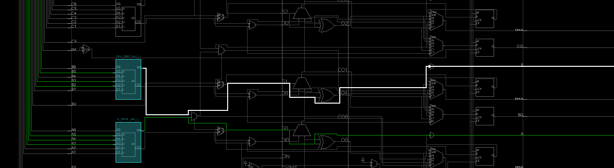

## 5 Latches and Flip Flops

Create these labs. Just do an RTL-schematic screen shot and something interesting device screen shot. Test them.  Copy all the bit files to a single folder so they can be demonstrated quickly all at once. 

The text associated with them is a pdf called Lab5. Figure out what points the text is making and create prompts in your lab notebook for yourself.

Lab5_1_1 is working. 
Labs 5_1_2 and 5_1_3 have a  file called "lab5_prehook". But the single line in this file in the xdc file. 

The major take away from this lab is using the tb_bench and understanding what a synchronous reset is. In the future we are going to be letting Vivado choose when to use a flip flop, not directly using them. 

## 5_1_1SR_Latch

#### RTL Schematic Screen shot

#### Implementation Device screen shot zoomed in on something interesting

The white wire showing the loop is coming back to R and  afrom Qbar

Another 

#### Testing

When S=0, R=0 <<< this is remember state

When S=1, R=1 then Q and Qbar is 0 <<< this is the invalid state

When S=1, R=0 then Q=0, Qbar =1  : this called set state then turn S=0, R=0 then Q=0 and Qbar=1

Turn S=0, R=1 then Q=1, Qbar = 0 : This called reset state then turn S=0, R=0 then Q = 1 and Qbar = 0

#### Prompt 

How many loops can find in the Implementation Device? **1 loop**

does it different with the expected SR latch ?  **Yes** 

It supported to have two loop,  But it's only one loop and another 1 go through the LED and controlled by the switch. It might be because of the code given the initial value is Q = 1 and Qbar = 1

## 5_1_2_Gated Latch

#### RTL Schematic Screen shot

#### Implementation Device screen shot zoomed in on something interesting

The white line shows the loop, expected has two loops but when running it just only have 1 loop

#### Testing

Enable = 0: The circuit go to remember state

Enable = 1, Set = 1, Reset = 0 -> Q = 1 and Qbar = 0  --> set state

Enable = 1, Set = 0, Reset =1 --> Q =0 and Qbar = 1 --> reset state

Enable =1, Set = 1, Reset =1 --> Metastable state

#### Prompt 

test bench 

red place is the metastable state

## 5_1_3_D_Latch

#### RTL Schematic Screen shot

#### Implementation Device screen shot zoomed in on something interesting

white line is the loop (Q_OBUF)(set state)

white line is Qbar_OBUF (reset state) 

#### Testing

D=1, Enable = 1 --> set state

D=1, Enable = 0 --> hold state

D=0, Enable=0 --> hold state

D=0, Enable = 1 --> reset state

#### Prompt 

test bench 

red place is the latch state

## 5_2_1_D_FlipFlop

#### RTL Schematic Screen shot

  

#### Implementation Device screen shot zoomed in on something interesting

#### Testing

Clk = 1, D=1 --> Q=0 until turn off Clk and turn on again then Q=1

#### Prompt 

test bench

## 5_2_2_circuit

#### RTL Schematic Screen shot

#### Implementation Device screen shot zoomed in on something interesting

#### Testing

#### Prompt 

Timing diagram

## 5_2_3_D_Flipflop_sync_reset_behavior

#### RTL Schematic Screen shot

#### Implementation Device screen shot zoomed in on something interesting

#### Testing

#### Prompt 

Timing diagram 

## 5_2_4_D_Flipflop_with_ce_and_sync_reset_behavior

#### RTL Schematic Screen shot

#### Implementation Device screen shot zoomed in on something interesting

#### Testing

#### Prompt 

## 5_2_5_T_Flipflop_enable_behavior

#### RTL Schematic Screen shot

#### Implementation Device screen shot zoomed in on something interesting

#### Testing

#### Prompt 