## Lab6 Shift Registers

When several flip-flops are grouped together, with a common clock, to hold related information the resulting circuit is called a register. Just like flip-flops, registers may also have other control signals. You will understand the behavior of a register with additional control signals. Counters are widely used sequential circuits. In this lab you will model several ways of modeling registers and counters.

Create these labs. Just do an RTL-schematic screen shot and something interesting device screen shot. Test them.  Copy all the bit files to a single folder so they can be demonstrated quickly all at once. 

The major take away from this lab is able to model various types of registers and various types of counters.

## 6_1_1Register_with_synch_reset_load_behavior

#### RTL Schematic Screen shot

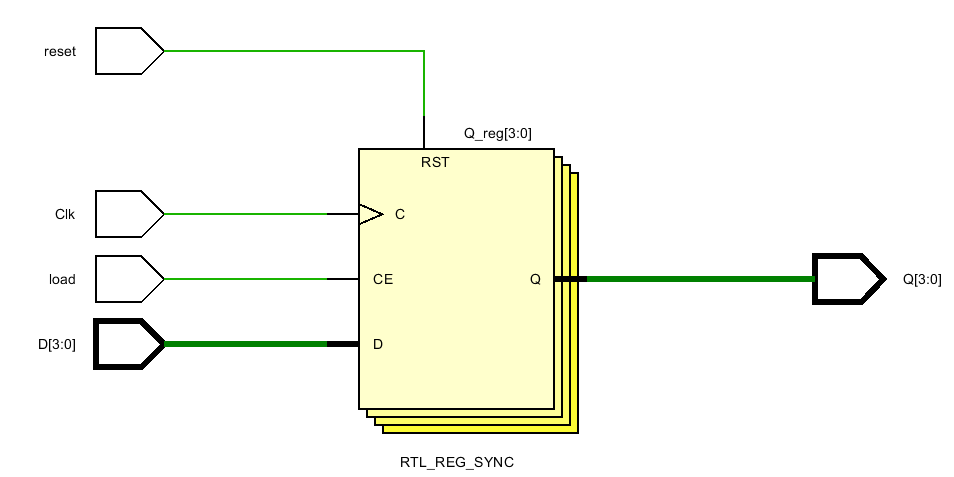

#### Implementation Device screen shot zoomed in on something interesting

4 D flipflop are connected

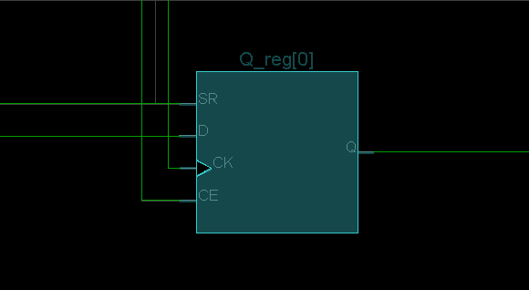

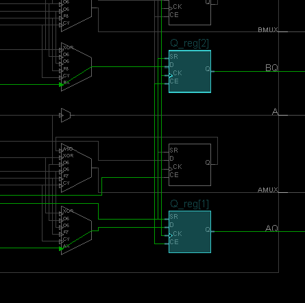

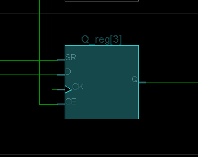

#### Testing

When input D is 0110, load on, clk on/off then the output Q is 0110

When reset on, clk on/off then the output Q is 0000

#### Prompt 

written in notebook page 153

## 6_1_2Register_with_synch_set_reset_load_behavior

#### RTL Schematic Screen shot

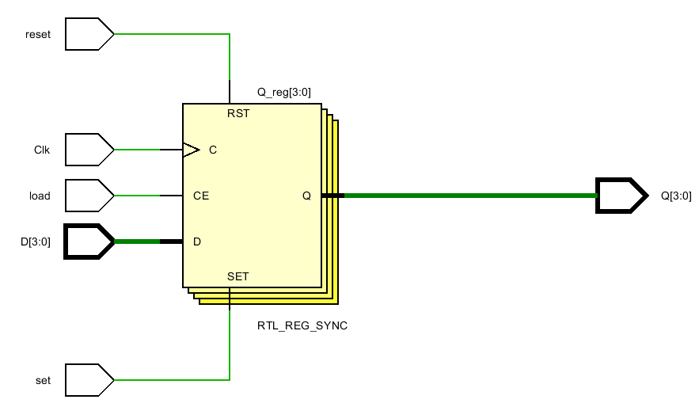

#### Implementation Device screen shot zoomed in on something interesting

Four A5LUT connected to D flip flop, The A5LUT of Q[1] is inside the A5LUT of Q[0]

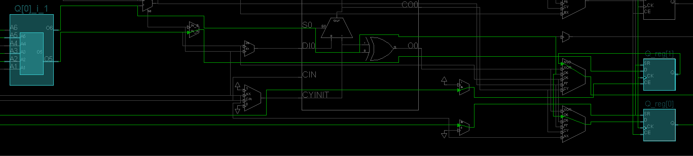

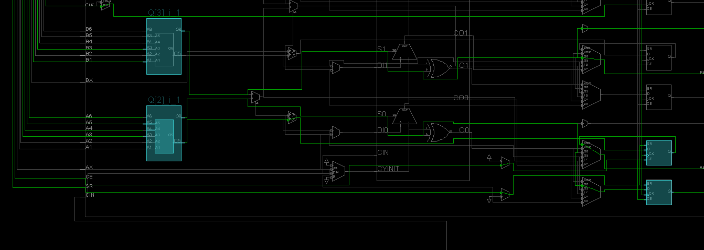

#### Testing

When set on, turn clk on/off, the output Q is 1111

When reset on, turn clk on/off, the ouput Q is 0000

When input D is 0101, load on, turn clk on/off the output Q is 0101

#### Prompt 

written in the notebook page 155

## 6_1_3Delay_line3_behavior

#### RTL Schematic Screen shot

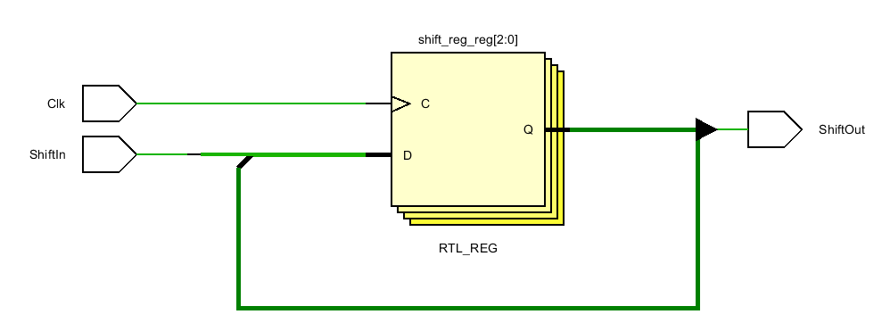

#### Implementation Device screen shot zoomed in on something interesting

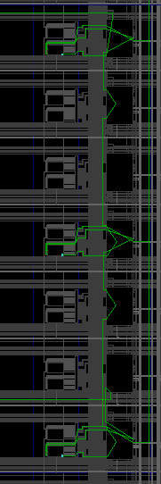

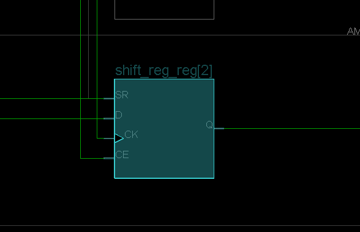

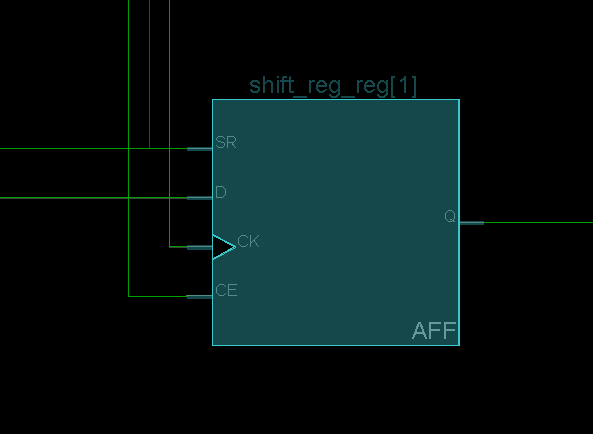

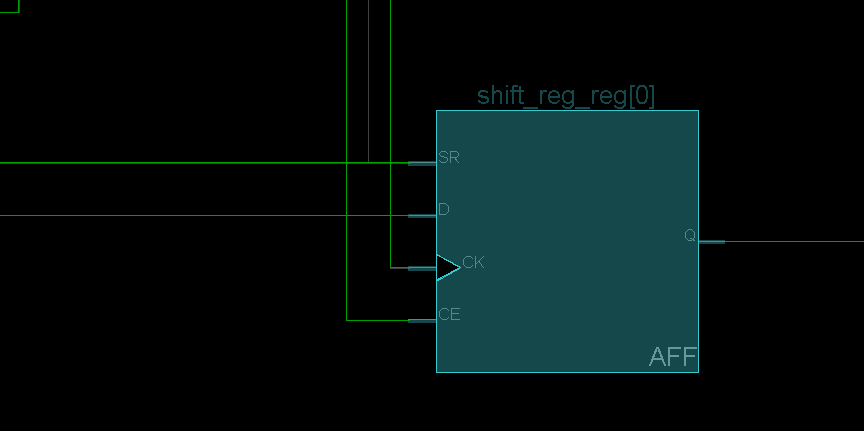

AFF MUX

#### Testing

ShiftIn on, Clk on/off/on/off/on (Means delay 3 blocks) , the output ShiftOut on

Turn ShiftIn off, Clk off, the output ShiftOut still on

Turn Clk on/off/on/off/on (Means delay 3 blocks) ,  the ouput ShiftOut off

#### Prompt 

written on notebook page 81 (notebook_2)

## 6_1_4Parallel_in_serial_out_load_enable_behavior

#### RTL Schematic Screen shot

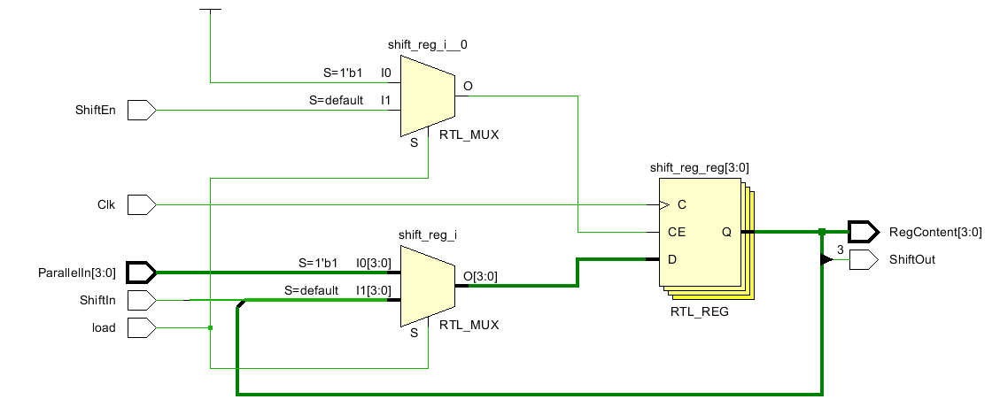

#### Implementation Device screen shot zoomed in on something interesting

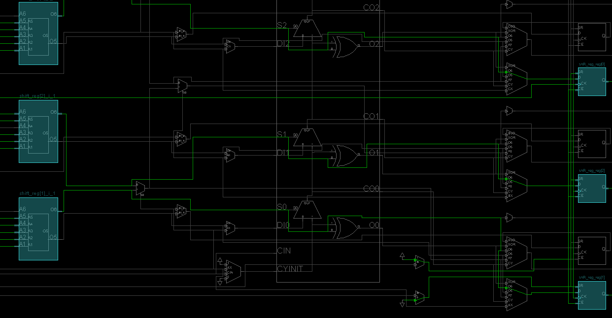

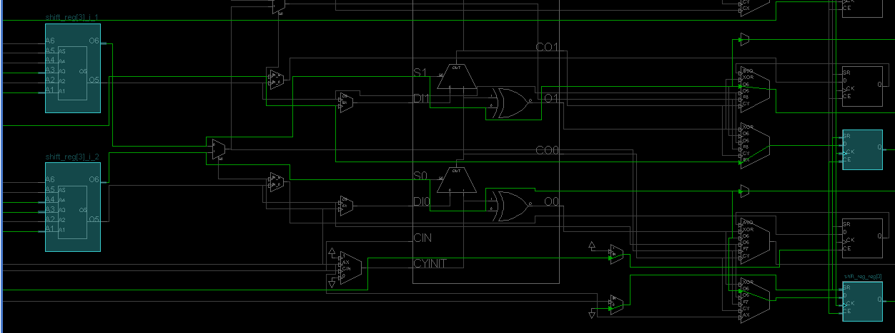

#### Testing

Base on timing diagram. successful to testing shift left

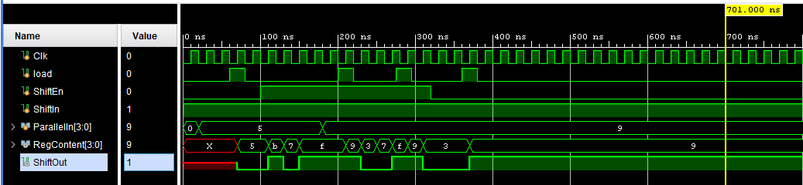

#### Prompt 

written notebook on page 83

## 6_1_5Serial_in_parallel_out_enable_behavior

#### RTL Schematic Screen shot

#### Implementation Device screen shot zoomed in on something interesting

#### Testing

#### Prompt 

## 6_2_1Eight_bit_counter_with_T_flop_behavior

#### RTL Schematic Screen shot

#### Implementation Device screen shot zoomed in on something interesting

#### Testing

#### Prompt 

## 6_2_2Eight_bit_counter_with_D_flop_behavior

#### RTL Schematic Screen shot

#### Implementation Device screen shot zoomed in on something interesting

#### Testing

#### Prompt 

## 6_2_3Four_bit_down_counter_with_load_enable_behavior

#### RTL Schematic Screen shot

#### Implementation Device screen shot zoomed in on something interesting

#### Testing

#### Prompt 

