## Lab6 Shift Registers

When several flip-flops are grouped together, with a common clock, to hold related information the resulting circuit is called a register. Just like flip-flops, registers may also have other control signals. You will understand the behavior of a register with additional control signals. Counters are widely used sequential circuits. In this lab you will model several ways of modeling registers and counters.

Create these labs. Just do an RTL-schematic screen shot and something interesting device screen shot. Test them.  Copy all the bit files to a single folder so they can be demonstrated quickly all at once. 

The major take away from this lab is able to model various types of registers and various types of counters.

## 6_1_1Register_with_synch_reset_load_behavior

#### RTL Schematic Screen shot

#### Implementation Device screen shot zoomed in on something interesting

4 D flipflop are connected

#### Testing

When input D is 0110, load on, clk on/off then the output Q is 0110

When reset on, clk on/off then the output Q is 0000

#### Prompt 

written in notebook page 153

## 6_1_2Register_with_synch_set_reset_load_behavior

#### RTL Schematic Screen shot

#### Implementation Device screen shot zoomed in on something interesting

Four A5LUT connected to D flip flop, The A5LUT of Q[1] is inside the A5LUT of Q[0]

#### Testing

When set on, turn clk on/off, the output Q is 1111

When reset on, turn clk on/off, the ouput Q is 0000

When input D is 0101, load on, turn clk on/off the output Q is 0101

#### Prompt 

written in the notebook page 155

## 6_1_3Delay_line3_behavior

#### RTL Schematic Screen shot

#### Implementation Device screen shot zoomed in on something interesting

AFF MUX

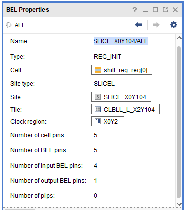

#### Testing

ShiftIn on, Clk on/off/on/off/on (Means delay 3 blocks) , the output ShiftOut on

Turn ShiftIn off, Clk off, the output ShiftOut still on

Turn Clk on/off/on/off/on (Means delay 3 blocks) ,  the ouput ShiftOut off

#### Prompt 

written on notebook page 81 (notebook_2)

## 6_1_4Parallel_in_serial_out_load_enable_behavior

#### RTL Schematic Screen shot

#### Implementation Device screen shot zoomed in on something interesting

#### Testing

Base on timing diagram. successful to testing shift left

#### Prompt 

written notebook on page 83

## 6_1_5Serial_in_parallel_out_enable_behavior

#### RTL Schematic Screen shot

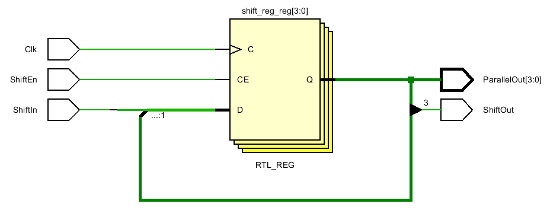

#### Implementation Device screen shot zoomed in on something interesting

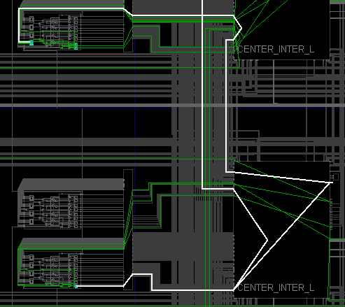

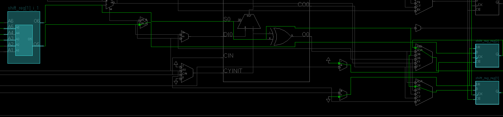

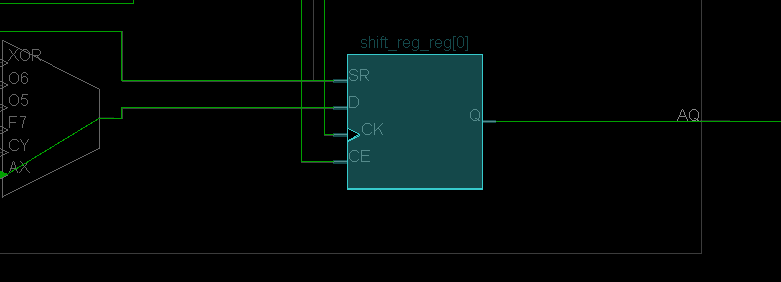

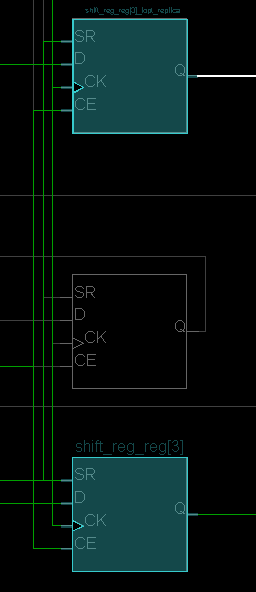

#### Testing

Base on the timing diagram, testing on the device. getting successful

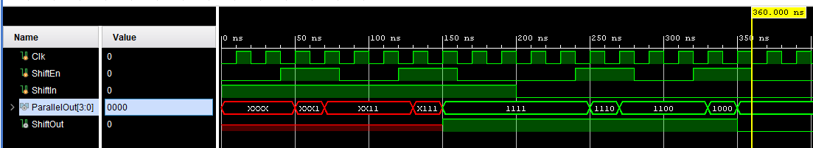

#### Prompt 

written on notebook page 85

## 6_2_1Eight_bit_counter_with_T_flop_behavior

#### RTL Schematic Screen shot

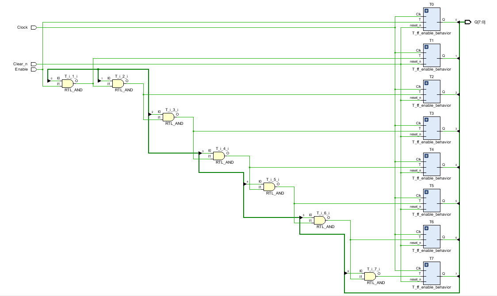

#### Implementation Device screen shot zoomed in on something interesting

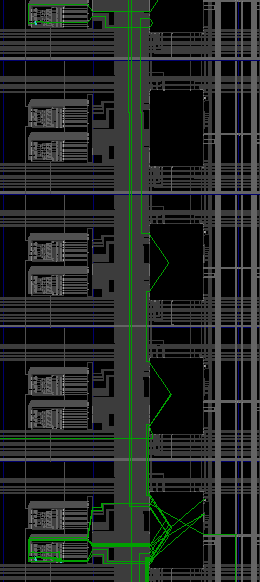

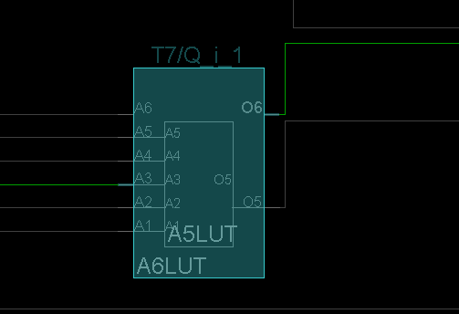

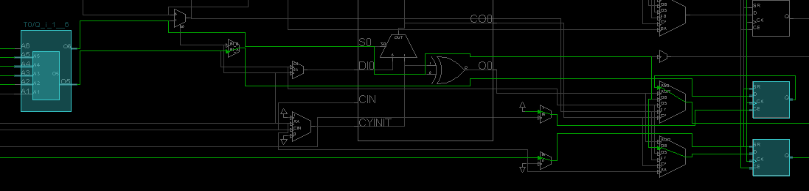

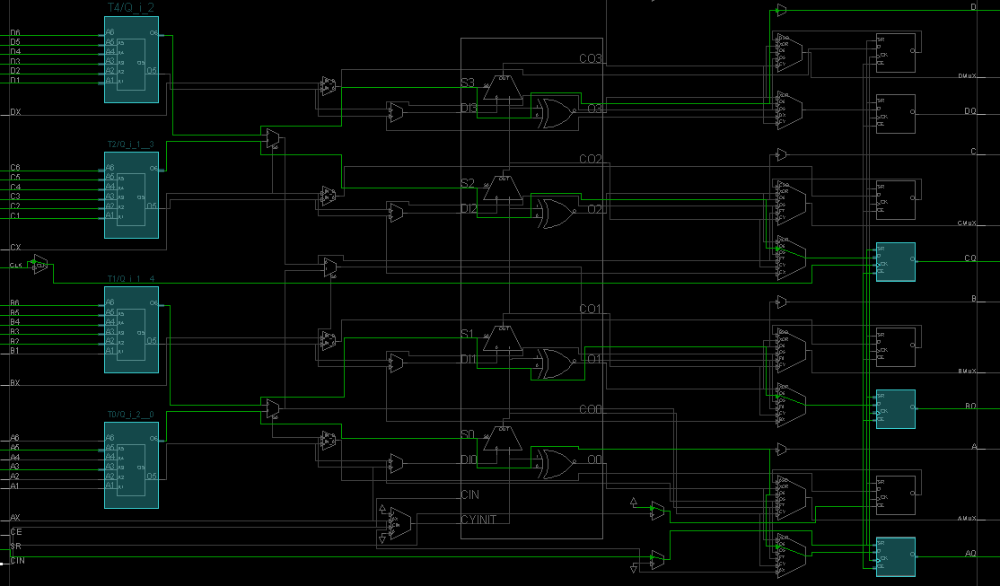

*** 8 LUT connected to D ff

#### Testing

Turn clear_n on, enable on, turn clk on/off --> out put start counting at 0000 0001, 0000 00010, 0000 0011 and so on.

Timing diagram:

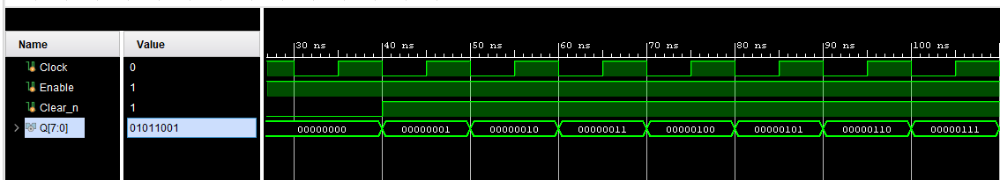

#### Prompt 

written on notebook page 85-89

## 6_2_2Eight_bit_counter_with_D_flop_behavior

#### RTL Schematic Screen shot

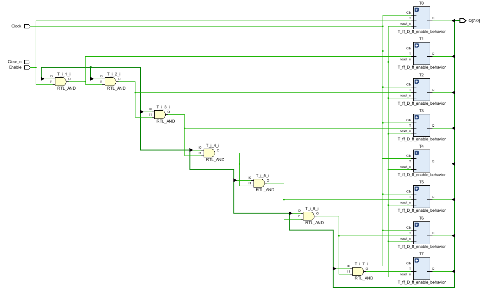

#### Implementation Device screen shot zoomed in on something interesting

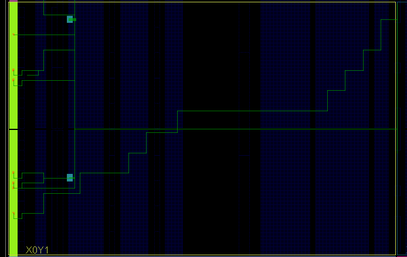

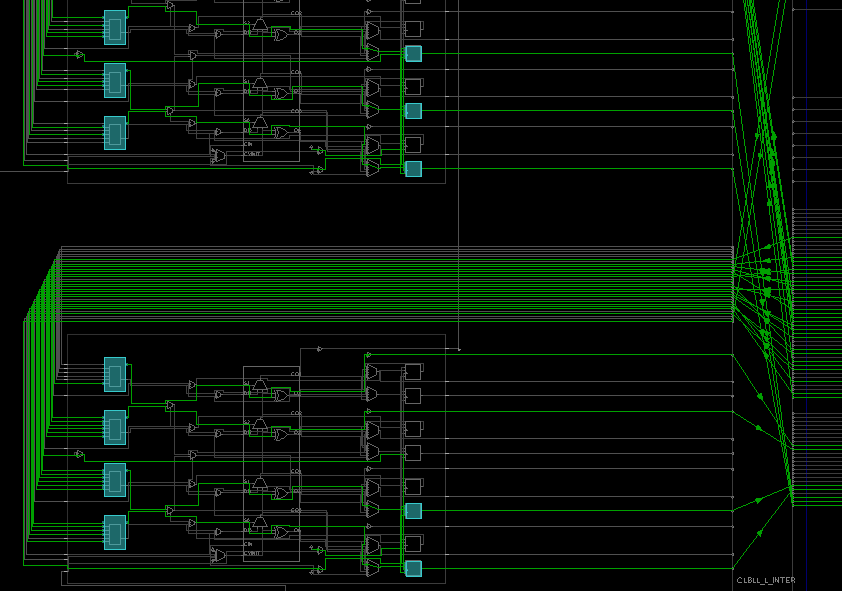

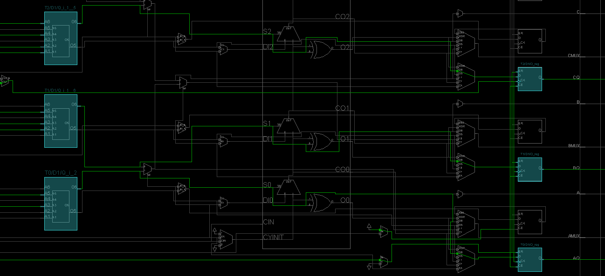

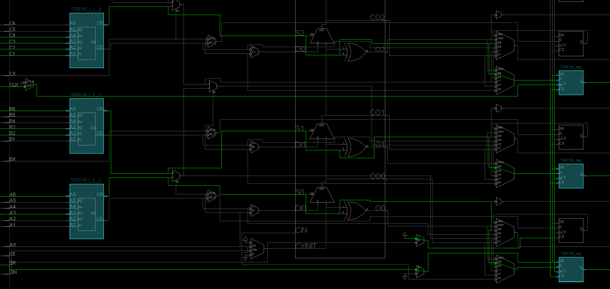

#### Testing

Instantiation off

When Clear_n = 1, Enable = 0, clock on/off ->> D output 0000 0000 

When Clear_n = 1, Enable = 1, clock on/off ->> D output 0000 0001.

Continuous to turn clock on/off ->> D output 0000 0010

... keep turn on the clock on/off -->> D output count until 1111 1111

When Clear_n = 1, Enable = 0, clock on/off ->> D output keep the same with previous state

When Clear_n = 0, Enable = 0, clock on/off ->> D output go back to off (0000 0000)

#### Prompt 

written on notebook page 89

The first module with the triangle in front is the top level

## 6_2_3Four_bit_down_counter_with_load_enable_behavior

#### RTL Schematic Screen shot

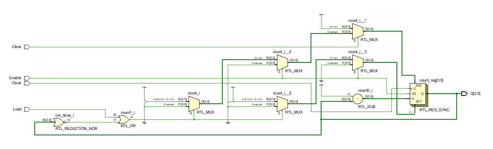

#### Implementation Device screen shot zoomed in on something interesting

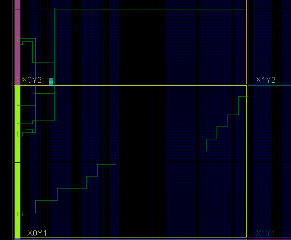

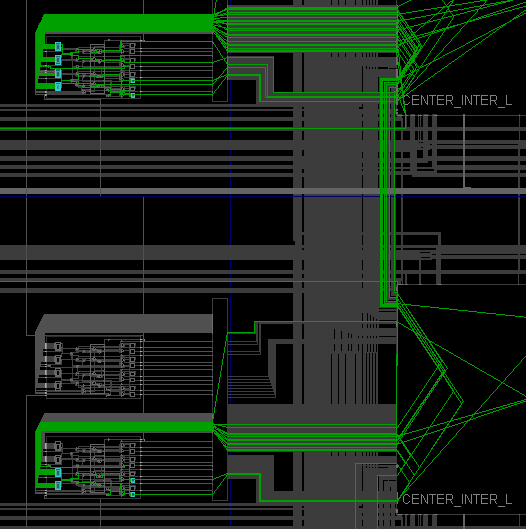

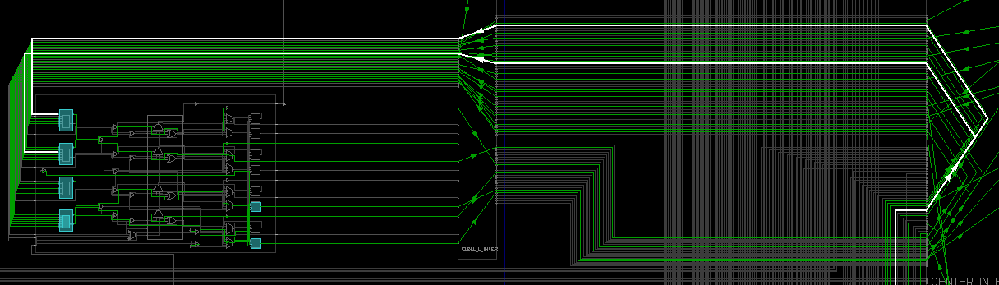

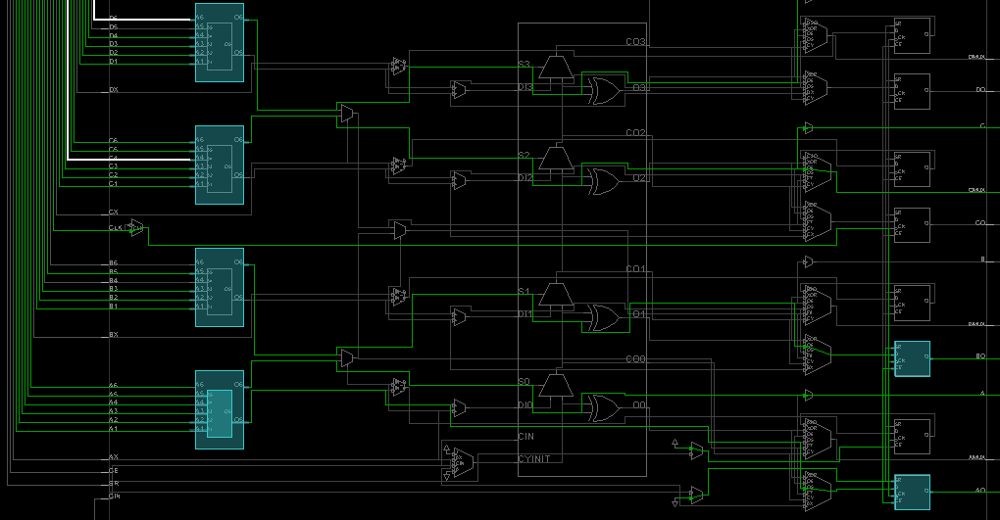

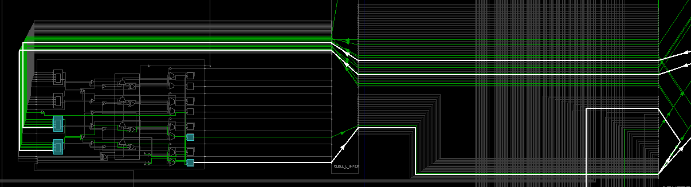

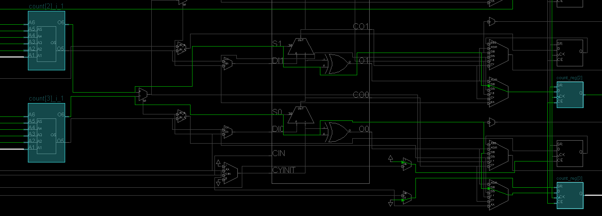

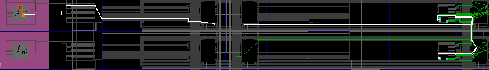

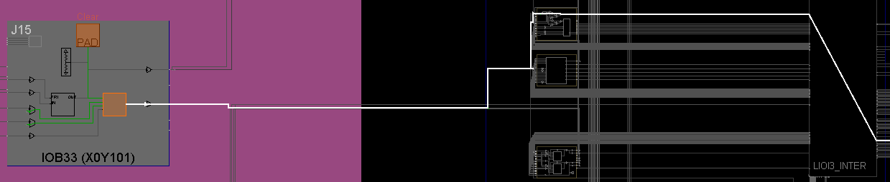

#### Testing

The same on Timing diagram 

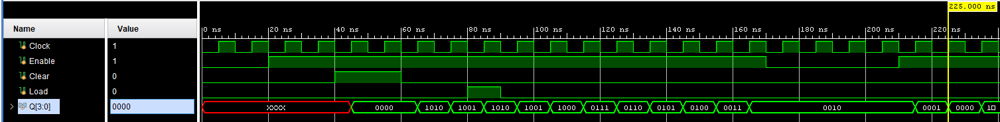

#### Prompt 

written on notebook.