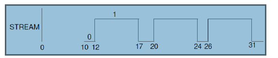
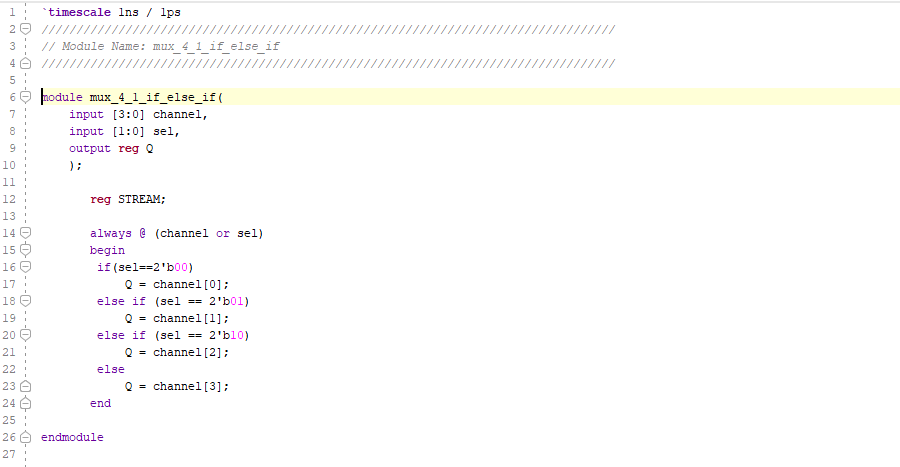
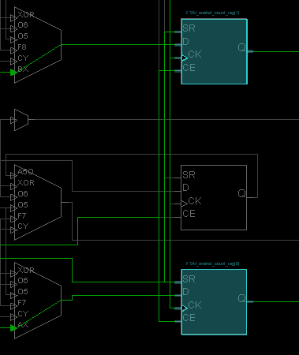

# Lab 7 Behavior_Modeling

In lab 1, the behavior was introduced as one of three widely used modeling styles.

In lab 4, additional capabilities with the respect to test benches were further introduced

In this lab, learn more language constructs and timing constraint concepts

The major to take away this lab is able to use various language constructs using behavioral modeling and to communicate timing expectations through timing constraints

Read [For Loop Pipelining example](https://www.xilinx.com/support/documentation/sw_manuals/xilinx2015_2/sdsoc_doc/topics/calling-coding-guidelines/concept_pipelining_loop_unrolling.html)

Write down the concept of Loop Pipelining on notebook.

## 7-part 1: Behavioral Modeling

## 7-1-1 Using inter-statement delays to produce the wave form (write the test bench)

Wave forms:

test bench for inter-statement delays

#### Prompt

timing diagram in vivado

PORT_A signal will get the value of 8'20 at 0, value of 8'hF2 at 5 (DELAY + 0=5+0=5), value of 8'h41 at 10, value of 8'h0A at 15  

## 7-1-2 Using inter-statement delays to produce the wave form (write the test bench)

wave form:

test bench follow the waveform above

#### Prompt

timing diagram in vivado

STREAM get 0 after 12 time unit delay, then get update 1 after 5 time unit delay, and back to 0 after 3 time unit delay, update to 1 after 4 time unit delay, back to 0 after 2 time unit delay, update to 1 after 5 time unit delay.

## 7-1-3 mux_4_1_if_else_if

#### Verilog code

#### RTL Schematic Screen Shot

#### Implementation Device screen shot zoomed in on something interesting

#### Testing

When sel[0] = 0, sel[1]=0 and channel[0] = 1--> output Q=1

When sel[0] = 1, sel[1]=0 and channel[1] = 1--> output Q=1

When sel[0] = 0, sel[1]=1 and channel[2] = 1--> output Q=1

When sel[0] = 1, sel[1]=1 and channel[3] = 1--> output Q=1

#### Prompt

exactly the same with the verilog code. from the if_else_if.

look like following the truth table. Just a LUT

## 7-1-4 Gray_code_case

#### Verilog code

#### RTL Schematic Screen Shot

#### Implementation Device screen shot zoomed in on something interesting

#### Testing

successful to testing on the NEXYS 4 DDR. 

#### Prompt

Written on notebook (page 97-99)

## 7-1-5 Specific counter case

#### Verilog code

#### RTL Schematic Screen Shot

#### Implementation Device screen shot zoomed in on something interesting

2 SR flipflop

2 LUT

4 flip flops

#### Testing

successful to test on the device look like the diagram

timing diagram

#### Prompt

written on the notebook (page 99-101)