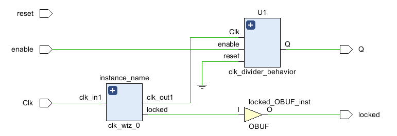

# Lab 8_Intellectual Property 

In this lab, learn how to use the Architectural  Wizard and IP Catalog

The major to take away this lab is able to use Architectural Wizard to configure clocking resource, use IP Catalog tool to configure and use counters and memories

## 8-part 1: Architectural Wizard

## 8-1-1 one-second_pulse_generator

#### Verilog code

* one_second_clock_behavior module

* clk_divider_behavior module

#### RTL Schematic Screen Shot

* the first plus sign of instance_name

* the second plus sign of instance_name

* the plus sign of U1

#### Implementation Device screen shot zoomed in on something interesting

#4LUT, 1 carrylogic and 4 flipflops

#4LUT, 1 carrylogic and 4 flipflops

#4LUT, 1 carrylogic and 4 flipflops

#4LUT, 1 carrylogic and 4 flipflops

#4LUT, 1 carrylogic and 4 flipflops

#4LUT, 1 carrylogic and 4 flipflops

#2LUT and 1 flipflop

#### Testing

the output clocked always on when run the program on Nexys 4 DDR

when turn the enable on, it bouncing (around 4194304 = 2^22 Hz )

#### Prompt

## 8-1-2 Display the 4-bit_binary_converted_to_BCD_on_two 7-segment_displays

#### Verilog code

#### RTL Schematic Screen Shot

#### Implementation Device screen shot zoomed in on something interesting

#### Testing

#### Prompt

## 8-part 2: IP Catalog

## 8-2-1 Generate a simple 4-bit counter core which counts up from 0 to 9

#### Verilog code

#### RTL Schematic Screen Shot

#### Implementation Device screen shot zoomed in on something interesting

#### Testing

#### Prompt

