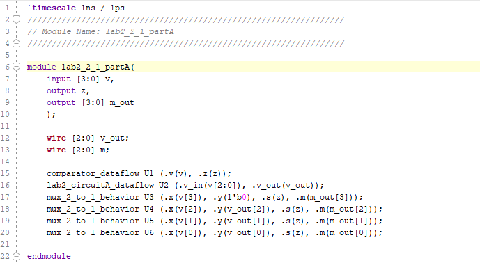
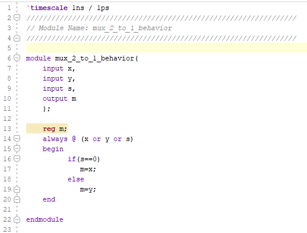
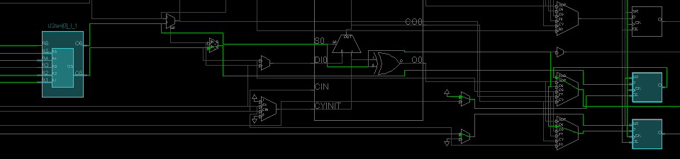
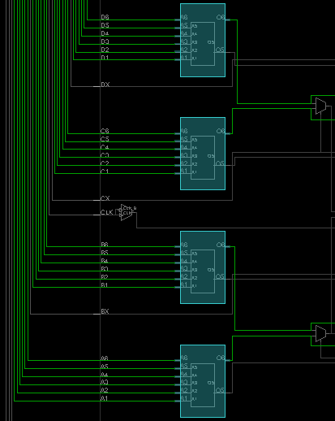
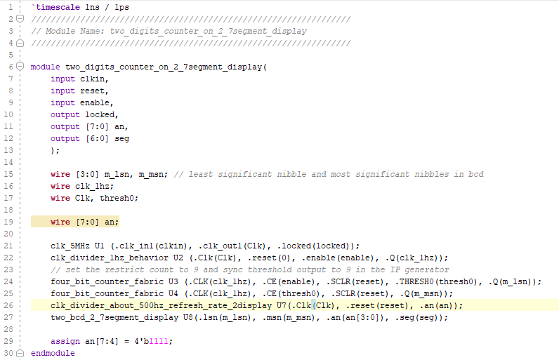
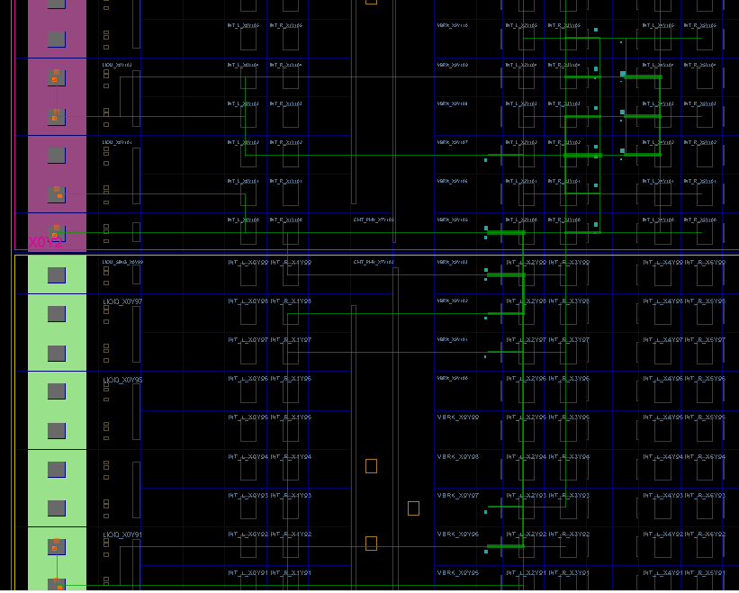

# Lab 8_Intellectual Property 

In this lab, learn how to use the Architectural  Wizard and IP Catalog

The major to take away this lab is able to use Architectural Wizard to configure clocking resource, use IP Catalog tool to configure and use counters and memories

## 8-part 1: Architectural Wizard

## 8-1-1 one-second_pulse_generator

#### Verilog code

* one_second_clock_behavior module

* clk_divider_behavior module

#### RTL Schematic Screen Shot

* the first plus sign of instance_name

* the second plus sign of instance_name

* the plus sign of U1

#### Implementation Device screen shot zoomed in on something interesting

#4LUT, 1 carrylogic and 4 flipflops

#4LUT, 1 carrylogic and 4 flipflops

#4LUT, 1 carrylogic and 4 flipflops

#4LUT, 1 carrylogic and 4 flipflops

#4LUT, 1 carrylogic and 4 flipflops

#4LUT, 1 carrylogic and 4 flipflops

#2LUT and 1 flipflop

#### Testing

the output clocked always on when run the program on Nexys 4 DDR

when turn the enable on, it bouncing (around 4194304 = 2^22 Hz )

#### Prompt

written on notebook (page 103-105)

## 8-1-2 Display the 4-bit_binary_converted_to_BCD_on_two 7-segment_displays

#### Verilog code

* Top level module:

  

* Bottom level module

  * lab2_2_1_partA.v

  

  + + comparator_dataflow.v

  

  * + lab2_circuitA_dataflow.v

    

  * + mux_2_to_1_behavior.v

    

  * clk_divider_about_500hz_refesh_rate_2display

    

  * two_bcd_2_7segment_display

    

  * + bcdto7segment_dataflow

      

#### RTL Schematic Screen Shot

#### Implementation Device screen shot zoomed in on something interesting

* The first blue point on the left 

  

* The small blue point on the top right

  

* The first blue point on the right

  

  

  

* The second blue point on the right 

  

  

  

* The third blue point on the right 

  

  

  

* The first blue point on the bottom left

  

* The second blue point on the bottom right

  

#### Testing

success to build the code on the Nexys 4 DDR

#### Prompt

written on notebook (page 107)

## 8-part 2: IP Catalog

## 8-2-1 Generate a simple 4-bit counter core which counts up from 0 to 9

#### Verilog code

* Top level module: two_digits_counter_on_2_7segment_display

* Bottom level module:

  * clk_5MHz using Architectural Wizard

    

  * clk_divider_1hz_behavior module

    

  * four_bit_counter_fabric (Binary counter)

    

    

  * clk_divider_about_500hz_refresh_rate_2display module

    

  * two_bcd_2_7segment_display

    

    * bcdto7segment_dataflow module

    ​	

#### RTL Schematic Screen Shot

#### Implementation Device screen shot zoomed in on something interesting

#a bunch of blue dots on the right side

#a blue dot on the left side

#### Testing

turn enable on, 7segment counts from 0 to 99. Then reset.

#### Prompt

Written on notebook(page 107-109)