# 0Lab 9_Stop Watch

In this lab, use the Architectural  Wizard and IP Catalog from previous lab 8 to generate various cores including counters (creating timers and real-time clocks)

The major to take away this lab is able to 

* Define a parameterized model

* Model counters using behavior modeling

* Design counters using IP catalog

* Compare and contrast the counters developed using the behavioral modeling and the IP Catalog

* Design timer circuits using the cores and using additional circuits modeled in HDL

  

## 9-part 1: Parameter and defparam Statements

## 9-1-1 carry-look-ahead adder

#### Verilog code

* Top level module: claadder_gate module

  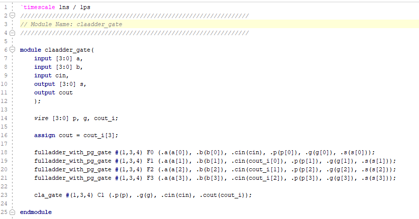

* bottom level module: 

  * fulladder_with_pg_gate module

    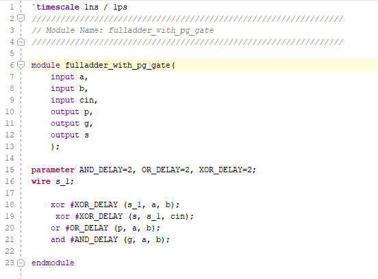

  * cla_gate module : 

    

#### RTL Schematic Screen Shot

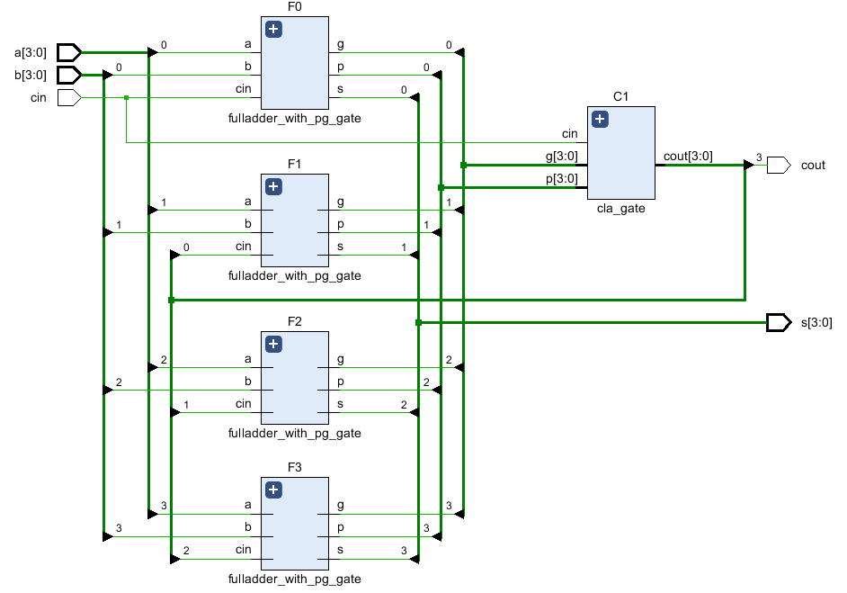

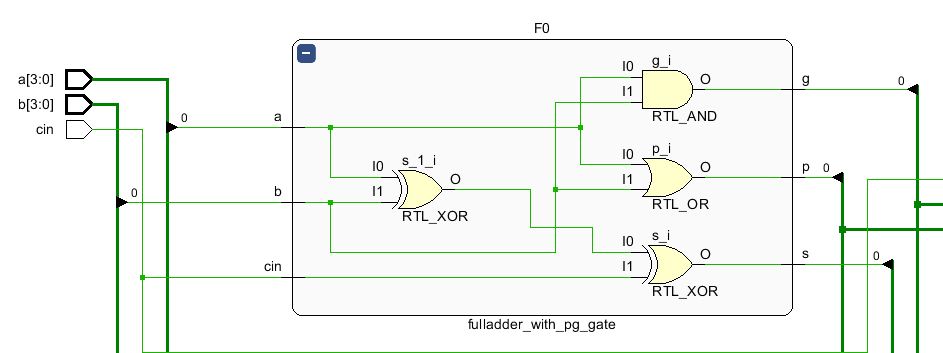

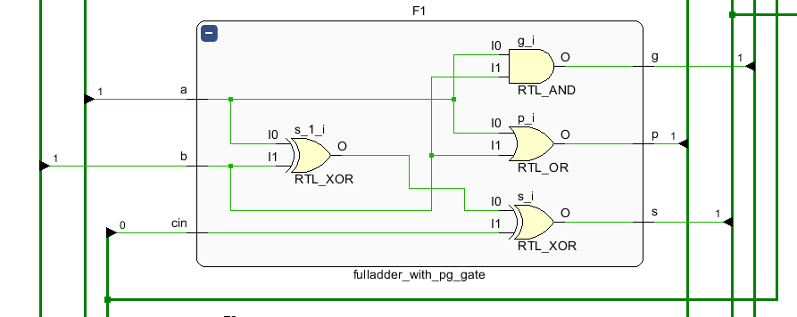

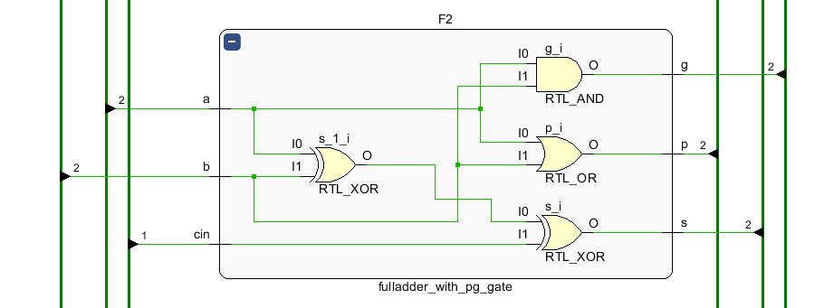

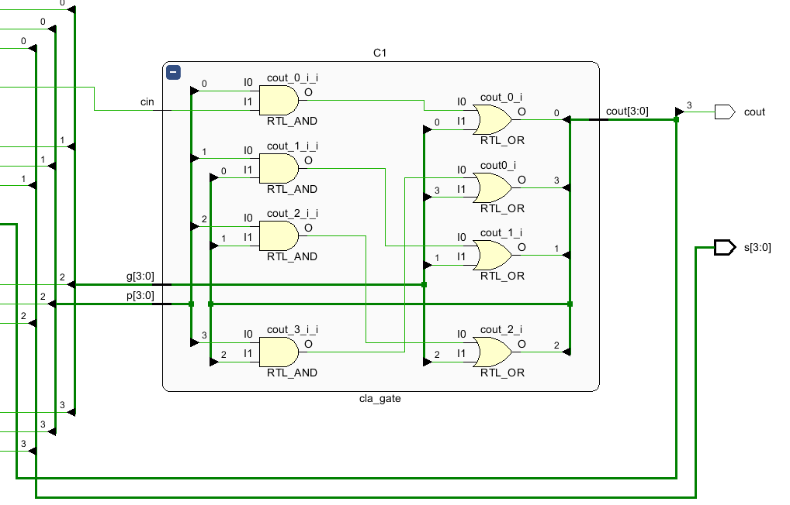

#### Implementation Device screen shot zoomed in on something interesting

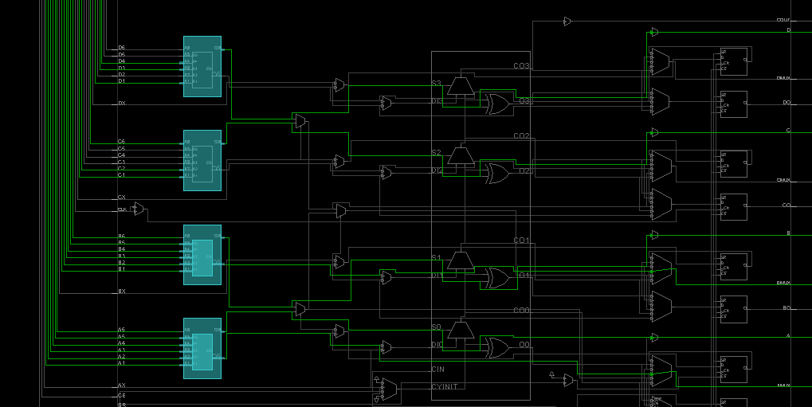

#### Testing

timing diagram 

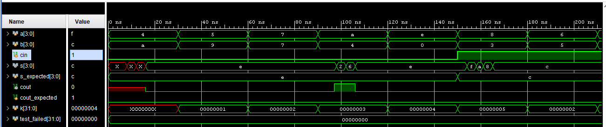

#### Prompt

written on notebook (page 111)

## 9-1-2 using the defparam instead of using the parameter on the lab9-1-1

#### Verilog code 

same as the previous lab

change the testbench from **parameter** 

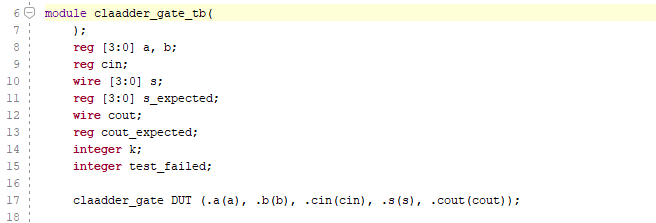

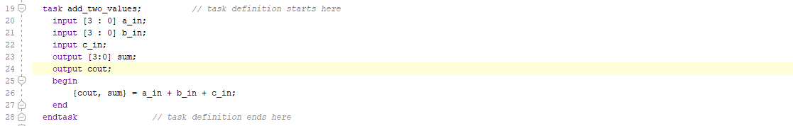

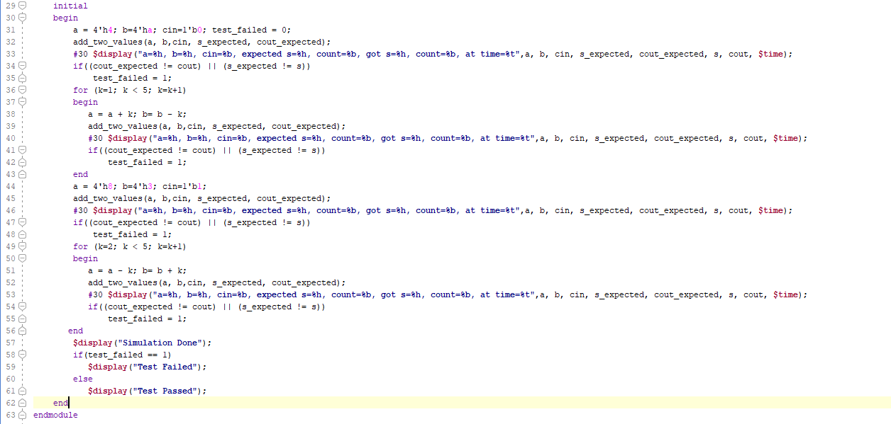

to **defparam statement**

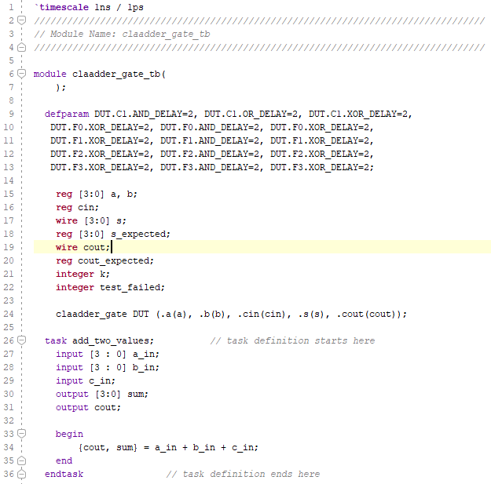

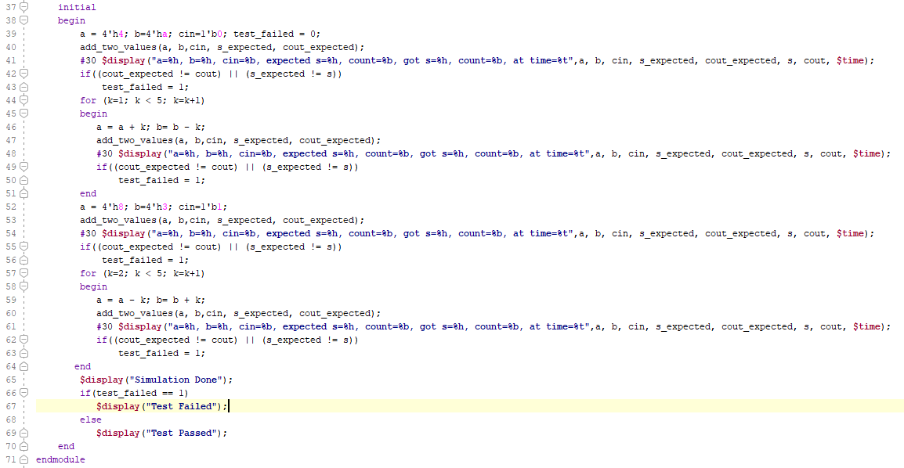

#### RTL Schematic Screen Shot

same as the previous lab

#### Implementation Device screen shot zoomed in on something interesting

same as the previous lab

#### Testing

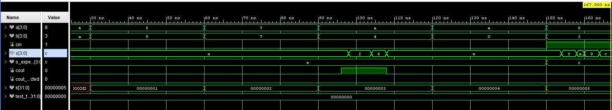

#### Prompt

the only different on the testbench code is using the defparam statement in the code. 

## 9-part 2: Counter and Used Resources

## 9-2-1 

#### Verilog code

#### RTL Schematic Screen Shot

#### Implementation Device screen shot zoomed in on something interesting

#### Testing

#### Prompt

Number of BUFG/BUFGCTRL: 2
Number of Slice LUTs used: 25
Number of FF used: 32
Number of DSP48E1 slices used: 0
Number of IOs used: 12

## 9-2-2

#### Verilog code

#### RTL Schematic Screen Shot

#### Implementation Device screen shot zoomed in on something interesting

#### Testing

#### Prompt

Number of BUFG/BUFGCTRL ______2________
Number of Slice LUTs used: ______22_______
Number of FF used: ______33_______
Number of DSP48E1 slices used: ______2________
Number of IOs used: ______12_______

## 9-2-3 

#### Verilog code

#### RTL Schematic Screen Shot

#### Implementation Device screen shot zoomed in on something interesting

#### Testing

#### Prompt

Number of BUFG/BUFGCTRL _______2_______
Number of Slice LUTs used: ______27_______
Number of registers used: ______32_______
Number of DSP48E1 slices used: _______0_______
Number of IOs used: ______12_______

## 9-2-4

#### Verilog code

#### RTL Schematic Screen Shot

#### Implementation Device screen shot zoomed in on something interesting

#### Testing

#### Prompt

Number of BUFG/BUFGCTRL ______2________
Number of Slice LUTs used: ______18________
Number of registers used: ______24_______
Number of DSP48E1 slices used: ______1________
Number of IOs used: ______12_________

## 9-part 3: Timers and Real-Time Clock

## 9-3-1 

#### Verilog code

#### RTL Schematic Screen Shot

#### Implementation Device screen shot zoomed in on something interesting

#### Testing

#### Prompt

## 9-3-2

#### Verilog code

#### RTL Schematic Screen Shot

#### Implementation Device screen shot zoomed in on something interesting

#### Testing

#### Prompt

## 9-3-3 

#### Verilog code

#### RTL Schematic Screen Shot

#### Implementation Device screen shot zoomed in on something interesting

#### Testing

#### Prompt